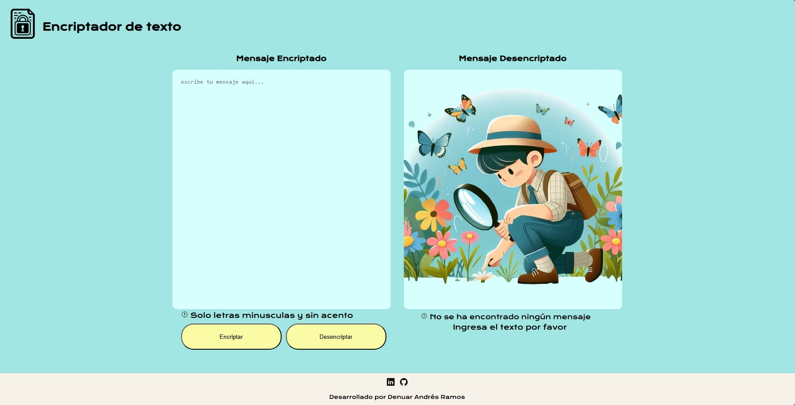
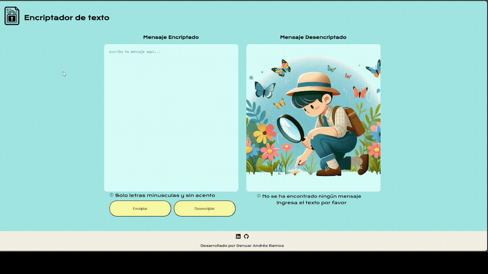
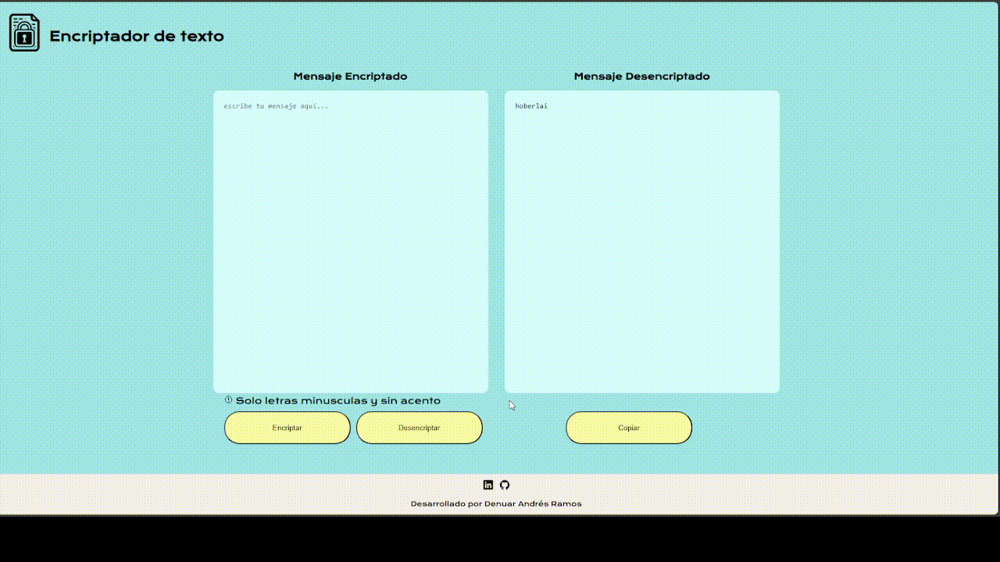

# Challenge Encriptador de texto

### Encriptador de texto hecho con HTML, CSS y JavaScript para el reto de Alura Latam





Para clonar el proyecto se realiza los siguientes comandos:

```
mkdir Encriptador
cd Encriptador
git clone https://github.com/TheBarrelExploit/Challenge-Encriptador-de-texto.git
cd Challenge-Encriptador-de-texto
```
Para ejecutar el código puede darle doble click al archivo llamado index.html o con la extensión de vscode llamada LiveServer 

# :hammer_and_wrench: Lenguajes utilizados:
<div> 
 &nbsp;
 &nbsp;
 &nbsp;
</div>


# 🔨 Funcionalidades 
- `Funcionalidad 1`: Encriptación y desencriptar texto 
- `Funcionalidad 2`: Copiar texto encriptado o desencriptado 

# Demo ⚙️
- Encriptar mensaje 

- Desencriptar mensaje 

- Copiar mensaje 


# Licencia 📄
Este proyecto está bajo la Licencia MIT - mira el archivo [LICENSE](LICENSE) para mas detalles para detalles


